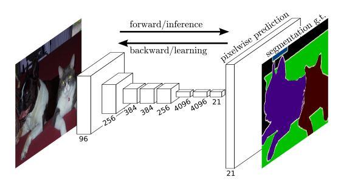
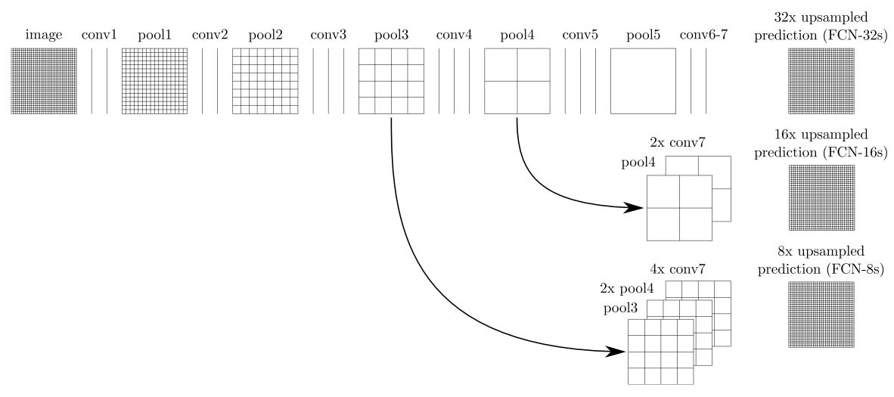
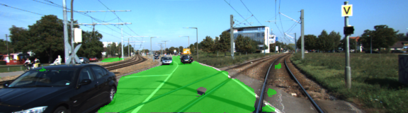

# Semantic Segmentation
Self-Driving Car Engineer Nanodegree Program Term3 Project 2

My code utilized a Fully Convolutional Network (FCN) to label the pixels of road in images. The FCN architecture is as below. Skip layer from VGG layer 3, 4 and 7 are combined with upsampled 1x1 convolutional layers.

Hyperparameters are chose with balance with accuracy and efficiency. L2 regularizer(1e-3) are used for all layers. Keep_prob is set to 0.5, learning rate = 0.0001. batch_siz =5.
With epochs =1, loss = 0.235. When epochs =10, loss = 0.108. Finally we use epochs =50, loss = 0.01.

All the labeled plots are in plots folder. Majority of them are correctly labeled with road vs non-road.

#### Outputs Snapshots
Here are examples of a sufficient vs. insufficient output from the trained network with epochs =50 vs 10:

Sufficient Result (epochs=50)         |  Insufficient Result(epochs=10)
:-------------------------:|:-------------------------:
  |  